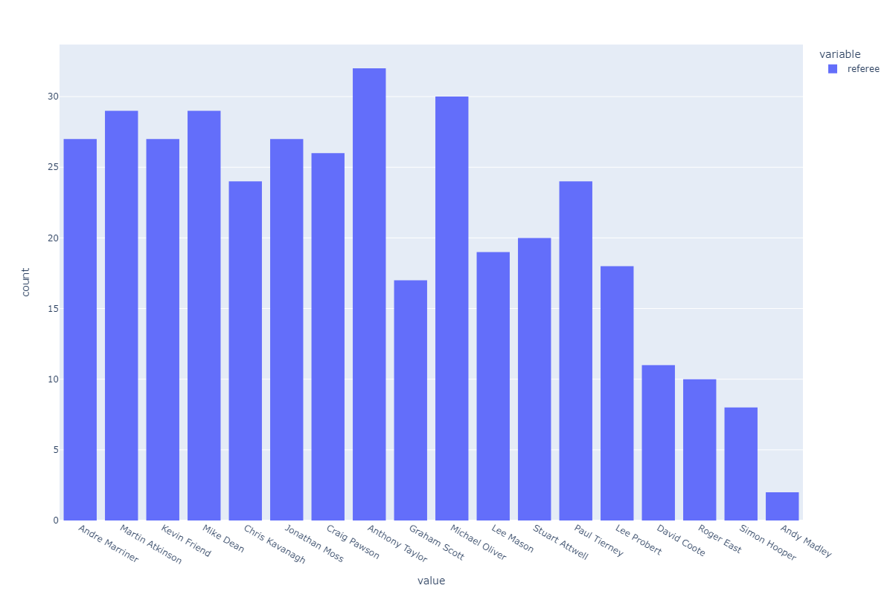
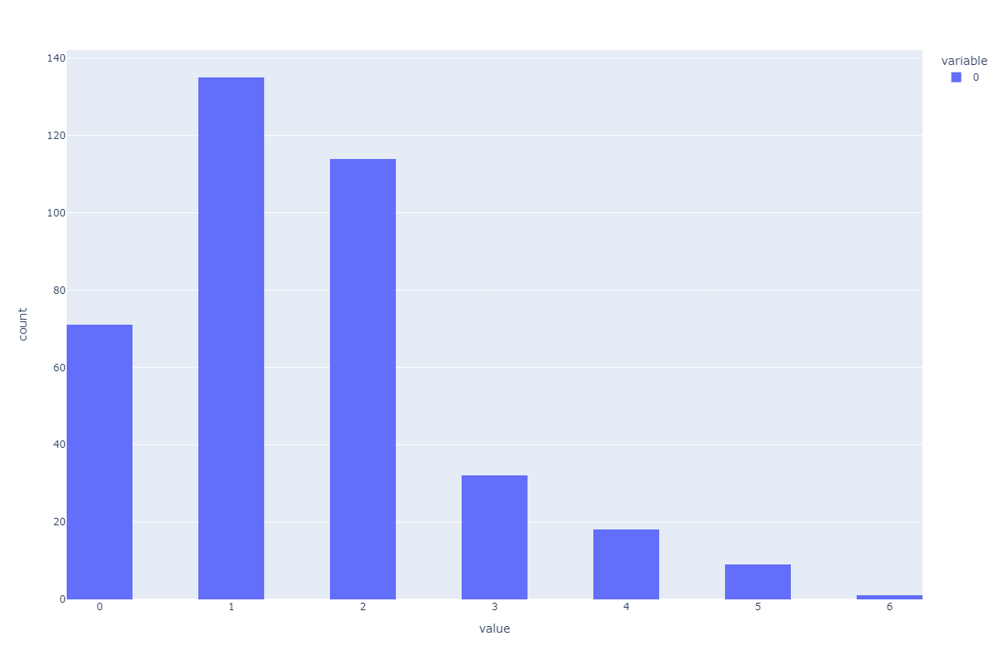
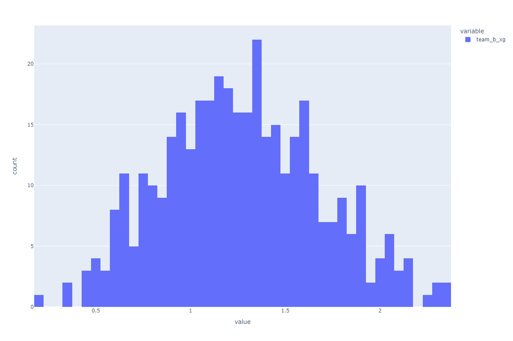
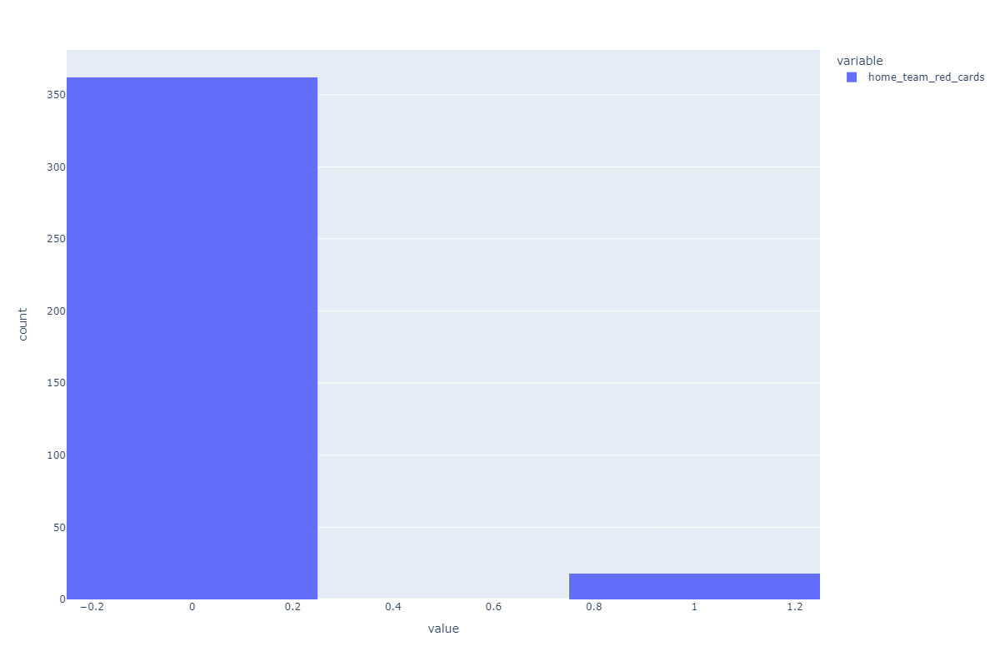
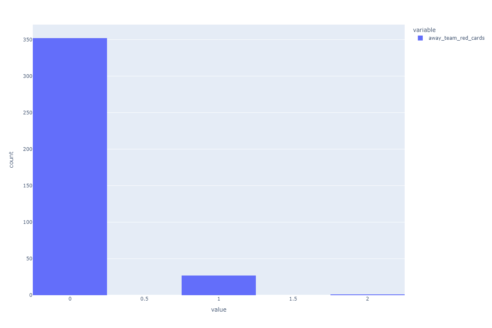
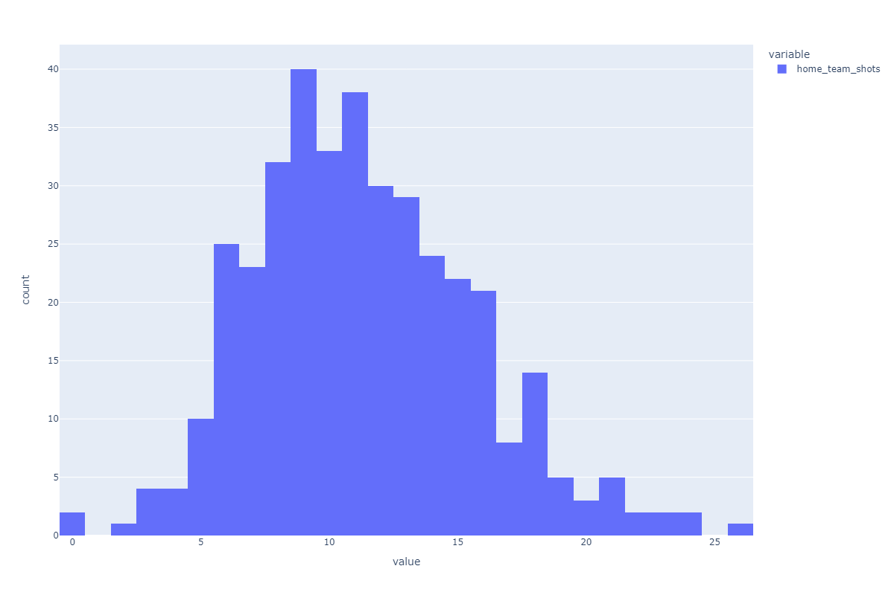
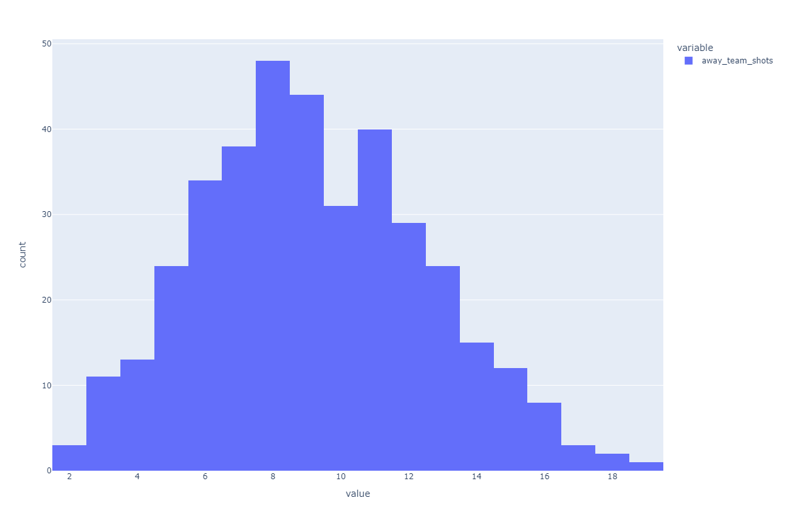
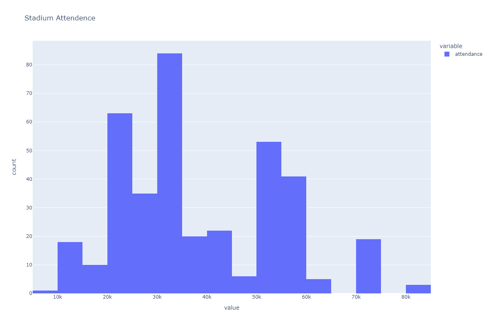

# Figures of Statistical Analyses Performed

As the 2018-19 season was nothing less than a thriller some of the statistics that have taken place in the specific season were staggering. These stats include record shots, scandal red cards, record attendance and referee assignments. The histograms below are materialized versions of some of the statistics seasonwide.

:::{important}

*The amount of games per referee in the 2018-19 season.*
:::

:::{important}

*Amount of goal differences per game.*
:::

:::{important}

*Goal expectancy of home team.*
:::

:::{important}

*Amount of red cards given to the home team.*
:::

:::{important}

*Amount of red cards given to the away team.*
:::

:::{important}

*Amount of home team shots per game.*
:::

:::{important}

*Amount of away team shots per game.*
:::

:::{important}

*Stadium attendance per game*
:::
